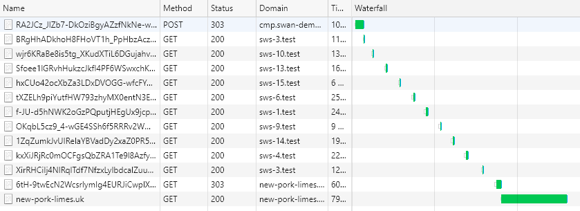

# 

# Secured Web Addressability Network (SWAN) – Data Flows

## Abstract

This document describes in detail the flow of data between publishers, CMPs and
the SWAN network, access, home and storage nodes.

## Actors

The data flows associated with SWAN involves the following actors.

| **Actor**          | **Description**                                                                                                                                                                                                                                                                                                                                                                                                                                                        |
|--------------------|------------------------------------------------------------------------------------------------------------------------------------------------------------------------------------------------------------------------------------------------------------------------------------------------------------------------------------------------------------------------------------------------------------------------------------------------------------------------|
| Web browser        | The user agent of the user providing the user interface.                                                                                                                                                                                                                                                                                                                                                                                                               |
| Publisher          | The web server operated by the publisher. Identified by an internet domain such as publisher.com. The publisher has opted to use the SWAN solution for the provision of the SWAN data.                                                                                                                                                                                                                                                                                 |
| SWAN Access Node   | The access node to the SWAN network provided by a SWAN operator. Identified by an internet domain such as swan-access-node.swanoperator.com.                                                                                                                                                                                                                                                                                                                           |
| SWAN Storage Nodes | Multiple storage nodes used to read and write cookies to the web browser. Each node will have a single internet domain associated with it.                                                                                                                                                                                                                                                                                                                             |
| CMP                | The Consent Management Platform (CMP) responsible for the user interface that enables users to inspect, enter and edit their preferences and identity.                                                                                                                                                                                                                                                                                                                 |
| SWAN Home Node     | The SWAN operator will assign a home node for the web browser based on some information transmitted by the browser that does not change very often. For example; the IP address, or HTTP headers. The home node is always consulted first and last in the storage operations of fetch and update to ensure it is statistically likely to contain the most recent version of the SWAN data. See the [technical explainer](explainer-technical.md) for more information. |

The publisher, SWAN nodes and the CMP are all bound by the same [model
contract](model-contract.md).

The meaning of SWAN data is defined in the model contract including SWID.

## Network developer tool

Reading this document alongside the network tab in the developers tools option
of a web browser will aid in understanding the data flow as observed from the
web browser.

The following screen shot shows the log generated when updating the SWAN data
from the CMP.

The following important features of SWAN are shown.

-   The home node sws-3.test is shown immediately after the CMP domain and as
    the final SWAN domain prior to the publisher’s domain.
-   HTTP 303 redirect codes are not used for many of the redirects as it is
    important to show the user progress via a rendered web page prior to the
    redirect.
-   Each HTTP response containing HTML is a complete response and no addition
    resources like CSS or JavaScript are fetched.

## URL construction

If further inspection is performed on the storage nodes URLs like the following
are revealed.

http://sws-6.test/c3dzLTYudGVzdHN3eDMgUrFeM7S1kUt4R-En5kwrl-k/tXZELh9piYutfHW793zhyMX0entN3E8q9q6oxC8ipXKh_mfUCsPwScUy8xNLSkWGVA1prajP9pGFp8cghVKCB_avaNa3HbF8SNEPethHrsZjlvu5psdBuKsIN0Mv5Mp_rXn_Z_02LZoJEmSld_S5jwC1ldtH6KwtGL1dOQ6G_eLwHGmktSo3LT0unlUiCFSCJ6\_d4SiDf77KbqAVYiJZY4W70UiqJsHt-gv7yPJr-8g-pD_WWShKkHFSKo2fWXrAnmEFQyPr1Z0QDyujuZ_DRVVlcFPB7f6IR8mecDhLRvhfJSSjTrbZFyF7hsGWiT8EldasTLWmBH1NmVoXQ9LH3nkDo27QDuM5sQGNNWfVFK8

The underlined section is unique to each storage node. The following section of
the path contains the encrypted storage operation data.

Path length will vary based on the length of the values provided by the user for
the email address.

## Data flows

The following tables indicate the actor involved via a X placed in the actor’s
column. A description of the activity that is occurring in the context of the
overall transaction flow is provided in the description.

### Initial publisher fetch of SWAN data

The following diagram describes the data flow associated with an initial request
to a publisher web site using a new web browser. Such a browser might be a
private web browsing session or a web browser on a new computer.

| **Step** | **Web Browser** | **Publisher** | **SWAN Access Node** | **SWAN Storage Nodes** | **SWAN Home Node** | **Description**                                                                                                                                                                                                                                                                                                                                                                                                                                    |
|----------|-----------------|---------------|----------------------|------------------------|--------------------|----------------------------------------------------------------------------------------------------------------------------------------------------------------------------------------------------------------------------------------------------------------------------------------------------------------------------------------------------------------------------------------------------------------------------------------------------|
| 1        | X               |               |                      |                        |                    | Navigates to publisher web page.                                                                                                                                                                                                                                                                                                                                                                                                                   |
| 2        |                 | X             |                      |                        |                    | Checks cookies to determine if current SWAN data is available. None present.                                                                                                                                                                                                                                                                                                                                                                       |
| 3        |                 |               | X                    |                        |                    | Confirms the validity of the publisher’s access credentials. Returns a URL that the publisher can use to redirect the web browser to that will retrieve the SWAN data and then return to the requesting publisher URL. The SWID is set to a random value in case a SWID does not yet exist for this web browser. The storage operation data is encrypted using the SWAN home node shared secret.                                                   |
| 4        |                 | X             |                      |                        |                    | Returns a response to the web browser to redirect to the URL provided in step 3.                                                                                                                                                                                                                                                                                                                                                                   |
| 5        | X               |               |                      |                        |                    | Changes the primary navigation of the web browser to the URL returned in step 4.                                                                                                                                                                                                                                                                                                                                                                   |
| 6        |                 |               |                      |                        | X                  | Checks cookies to determine if current SWAN data is available. None present. Decrypts the data contained in the URL using the shared secret. Sets response cookies for the SWAN data. Chooses the next storage node in the operation at random and encrypts the storage operation data using the shared secret of that node. Returns a web page with a progress indicator that after display will direct the web browser to the next storage node. |
| 7        | X               |               |                      |                        |                    | Displays the progress user interface and then changes the primary navigation of the web browser to the next URL.                                                                                                                                                                                                                                                                                                                                   |
| 8        |                 |               |                      | X                      |                    | Checks cookies to determine if current SWAN data is available. None present. Decrypts the data contained in the URL using the shared secret. Sets response cookies for the SWAN data. Chooses the next storage node in the operation at random and encrypts the storage operation data using the shared secret of that node. Returns a web page with a progress indicator that after display will direct the web browser to the next storage node. |

Steps 7 and 8 repeat for the number of SWAN storage nodes that should be
consulted during the storage operation. The last SWAN storage node is the SWAN
home node. Step 9 picks up from this point. The more nodes the system is
configured to use the more likely any existing information will be picked up,
but the longer the entire process will take to complete.

| **Step** | **Web Browser** | **Publisher** | **SWAN Access Node** | **SWAN Storage Nodes** | **SWAN Home Node** | **Description**                                                                                                                                                                                                                                                                                                                                                                                                                                                                                                                  |
|----------|-----------------|---------------|----------------------|------------------------|--------------------|----------------------------------------------------------------------------------------------------------------------------------------------------------------------------------------------------------------------------------------------------------------------------------------------------------------------------------------------------------------------------------------------------------------------------------------------------------------------------------------------------------------------------------|
| 9        |                 |               |                      |                        | X                  | Checks cookies to determine if current SWAN data is available. None present. Decrypts the data contained in the URL. Sets response cookies for the data contained in the URL. Encrypts the storage operation data using the shared secret of SWAN access node. Sets the last segment of the publisher URL provided in step 1 to this encrypted data. Enough nodes have been consulted. Returns a progress indicator at 100% and instructions to redirect the web browser back to the publisher with the encrypted data appended. |
| 10       | X               |               |                      |                        |                    | Displays the progress user interface and then changes the primary navigation of the web browser to the publisher URL.                                                                                                                                                                                                                                                                                                                                                                                                            |
| 11       |                 | X             |                      |                        |                    | Checks the last segment of the URL path for SWAN data. Extract this information and pass it to the SWAN operator to decrypt and decode.                                                                                                                                                                                                                                                                                                                                                                                          |
| 12       |                 |               | X                    |                        |                    | Confirms the validity of the publisher’s access credentials. Decrypts and decodes the information provided. Returns the SWAN data as JSON values. In this case only the SWID is populated as the other data does not yet exist for this web browser.                                                                                                                                                                                                                                                                             |
| 13       |                 | X             |                      |                        |                    | Set the SWAN data returned as response cookies. As the preference information has not been provided a URL to direct the web browser to the CMP. See section CMP display.                                                                                                                                                                                                                                                                                                                                                         |
| 14       | X               |               |                      |                        |                    | Redirect to the CMP.                                                                                                                                                                                                                                                                                                                                                                                                                                                                                                             |

### CMP display

| **Step** | **Web Browser** | **CMP** | **SWAN Access Node** | **SWAN Storage Nodes** | **SWAN Home Node** | **Description**                                                                                                                                                                                                                                                                                                                                                                                                                                                                                                                  |
|----------|-----------------|---------|----------------------|------------------------|--------------------|----------------------------------------------------------------------------------------------------------------------------------------------------------------------------------------------------------------------------------------------------------------------------------------------------------------------------------------------------------------------------------------------------------------------------------------------------------------------------------------------------------------------------------|
| 15       |                 | X       |                      |                        |                    | Passes details about the calling publisher.                                                                                                                                                                                                                                                                                                                                                                                                                                                                                      |
| 16       |                 |         | X                    |                        |                    | Confirms the validity of the CMP’s access credentials. Returns a URL that the CMP can use to redirect the web browser to that will retrieve the SWAN data and then return to the requesting publisher URL. The SWID is set to a random value in case a SWID does not yet exist for this web browser. The storage operation data is encrypted using the SWAN home node shared secret.                                                                                                                                             |
| 17       | X               |         |                      |                        |                    | Changes the primary navigation of the web browser to the URL returned in step 16.                                                                                                                                                                                                                                                                                                                                                                                                                                                |
| 18       |                 |         |                      |                        | X                  | Checks cookies to determine if current SWAN data is available. These cookies are present from step 6. However they only contain the SWID and not the other values. This is very important as it negates the need to inspect other nodes in the network. Decrypts the data contained in the URL using the shared secret. Determines that control can be returned to the CMP user interface URL. Encrypts the cookie provided SWAN data using the shared secret of the SWAN access node. Returns a URL for the CMP user interface. |
| 19       | X               |         |                      |                        |                    | Changes the primary navigation of the web browser to the URL returned in step 18.                                                                                                                                                                                                                                                                                                                                                                                                                                                |
| 20       |                 | X       |                      |                        |                    | Extracts the SWAN data from the last segment of the URL.                                                                                                                                                                                                                                                                                                                                                                                                                                                                         |
| 21       |                 |         | X                    |                        |                    | Decrypts the SWAN data using the share secret from step 18. Decodes the information and returns it to the CMP.                                                                                                                                                                                                                                                                                                                                                                                                                   |
| 22       |                 | X       |                      |                        |                    | Constructs a web page to display and edit the SWAN data returned in step 21. Returns the web page to the browser.                                                                                                                                                                                                                                                                                                                                                                                                                |
| 23       | X               |         |                      |                        |                    | Displays the web page and waits for user instruction.                                                                                                                                                                                                                                                                                                                                                                                                                                                                            |

The user can now reset the SWID, which results in a simple call to the CMP to
generate a new random identifier. They can also close the dialogue which will
result in the publisher page being redirect to. These scenarios are not shown as
they are conceptual simple and not unique to SWAN.

The following table shows the steps that are then completed once the user wishes
to update the SWAN data.

| **Step** | **Web Browser** | **CMP** | **SWAN Access Node** | **SWAN Storage Nodes** | **SWAN Home Node** | **Description**                                                                                                                                                                                                                                                                                                                                                                                                                                                                                                                                                                  |
|----------|-----------------|---------|----------------------|------------------------|--------------------|----------------------------------------------------------------------------------------------------------------------------------------------------------------------------------------------------------------------------------------------------------------------------------------------------------------------------------------------------------------------------------------------------------------------------------------------------------------------------------------------------------------------------------------------------------------------------------|
| 24       | X               |         |                      |                        |                    | The user presses the update button to trigger a POST back to the CMP.                                                                                                                                                                                                                                                                                                                                                                                                                                                                                                            |
| 25       |                 | X       |                      |                        |                    | The CMP validates the data provided, for example that a valid email address is provided. Unless reset the SWID will be the one generated at step 3.                                                                                                                                                                                                                                                                                                                                                                                                                              |
| 26       |                 |         | X                    |                        |                    | Confirms the validity of the CMP’s access credentials. Returns a URL that the CMP can use to redirect the web browser to that will update the SWAN data and then return to the requesting publisher URL. The storage operation data is encrypted using the SWAN home node shared secret.                                                                                                                                                                                                                                                                                         |
| 27       |                 | X       |                      |                        |                    | Returns a response to redirect the web browser to the URL provided in step 26.                                                                                                                                                                                                                                                                                                                                                                                                                                                                                                   |
| 26       | X               |         |                      |                        |                    | Redirect to the URL provided.                                                                                                                                                                                                                                                                                                                                                                                                                                                                                                                                                    |
| 27       |                 |         |                      |                        | X                  | Checks cookies to determine if current SWAN data is available. Decrypts the data contained in the URL using the shared secret. Determines that the data provided in the URL is newer than the data in the cookies. Sets response cookies to contain the data from the URL. Chooses the next storage node in the operation at random and encrypts the storage operation data using the shared secret of that node. Returns a web page with a progress indicator that after display will direct the web browser to the next storage node.                                          |
| 28       | X               |         |                      |                        |                    | Displays the progress user interface and then changes the primary navigation of the web browser to the publisher URL.                                                                                                                                                                                                                                                                                                                                                                                                                                                            |
| 29       |                 |         |                      | X                      |                    | Checks cookies to determine if current SWAN data is available. Decrypts the data contained in the URL using the shared secret. Determines that the data provided in the URL is newer than the data in the cookies. Sets response cookies to contain the data from the URL. Sets response cookies for the SWAN data. Chooses the next storage node in the operation at random and encrypts the storage operation data using the shared secret of that node. Returns a web page with a progress indicator that after display will direct the web browser to the next storage node. |

The cycle shown in 28 and 29 continues until the home node is reached again.

| **Step** | **Web Browser** | **Publisher** | **SWAN Access Node** | **SWAN Storage Nodes** | **SWAN Home Node** | **Description**                                                                                                                                                                                                                                                                                                                                                                                                                                                                                                                                                                                                                                                                                                                                     |
|----------|-----------------|---------------|----------------------|------------------------|--------------------|-----------------------------------------------------------------------------------------------------------------------------------------------------------------------------------------------------------------------------------------------------------------------------------------------------------------------------------------------------------------------------------------------------------------------------------------------------------------------------------------------------------------------------------------------------------------------------------------------------------------------------------------------------------------------------------------------------------------------------------------------------|
| 30       |                 |               |                      |                        | X                  | Checks cookies to determine if current SWAN data is available. Decrypts the data contained in the URL. The data in the URL and the cookies will now match. This is positive confirmation that the transaction completed. If cookies are disabled then there will be no cookie information available as a result of step 27. This can be used to display a message to the user to enable cookies. Encrypts the storage operation data using the shared secret of SWAN access node. Sets the last segment of the publisher URL provided in step 1 to this encrypted data. Enough nodes have been consulted. Returns a progress indicator at 100% and instructions to redirect the web browser back to the publisher with the encrypted data appended. |
| 31       | X               |               |                      |                        |                    | Changes the primary navigation of the web browser to the URL returned in step 30.                                                                                                                                                                                                                                                                                                                                                                                                                                                                                                                                                                                                                                                                   |
| 32       |                 | X             |                      |                        |                    | Checks the last segment of the URL path for SWAN data. Extract this information and pass it to the SWAN access node to decrypt and decode.                                                                                                                                                                                                                                                                                                                                                                                                                                                                                                                                                                                                          |
| 33       |                 |               | X                    |                        |                    | Confirms the validity of the publisher’s access credentials. Decrypts and decodes the information provided. As the CMP added the preferences and the email address we now have more data. The email address is converted into a hash of the original value. All the information is returned as JSON.                                                                                                                                                                                                                                                                                                                                                                                                                                                |
| 34       |                 | X             |                      |                        |                    | Set the SWAN data returned as response cookies. These cookies are set to last for the duration of the session. Uses the SWAN data to display advertising using whatever existing methods are required.                                                                                                                                                                                                                                                                                                                                                                                                                                                                                                                                              |
| 35       | X               |               |                      |                        |                    | Displays the publishers page and triggers any requests for advertising.                                                                                                                                                                                                                                                                                                                                                                                                                                                                                                                                                                                                                                                                             |

### Subsequent publisher fetch of SWAN data

[ TO BE ADDED]

### General information

Some important details applied to multiple steps are not included in the
previous tables for brevity. These are:

1.  The SWAN access node is never known by the web browser.
2.  All encryption operations include nonce so that the same input never
    produces the same output.
3.  Cookies are also encrypted using nonce to ensure that they are never the
    same twice.
4.  The first segment of the URL used by SWAN storage and home nodes is
    scrambled for each node so that it is not the same across storage nodes. The
    second segment of the URL containing the storage operation data is encrypted
    using nonce to ensure it is never the same twice.
5.  The values returned are Open Web ID encoded and will need to be unpacked
    before the raw data can be used.

## Important features

The following important design features can be observed.

1.  As the home node is likely to contain the most recent version of the data
    this storage node is used most often for read operations. As read operations
    are the most frequently occurring operation the performance is comparable to
    a single domain being used to store data in cookies without the problems of
    centralization or the browser becoming aware of the domain being used for
    this purpose.
2.  As the information is shared across publishers there is the possibility that
    the data is updated in SWAN by one publisher, and then does not become known
    to other publishers until after these other publisher sessions expire. The
    SWAN model contract will ensure that users are aware of and accept this
    possibility.
3.  Only CMPs receive the email address in its original form for the purposes of
    display and update. Publishers access keys only ever entitle them to receive
    the hash version of the email address.
4.  The SWAN data held in the publisher’s domain will be valid for as long as
    the session lasts. It does not need to be fetched repeatably for every
    publisher page visited during the session.
5.  If the session expires then SWAN is consulted again. As the fetch process
    consults the home node first, and the home node is consistent across all
    domains for the web browser, it is likely to contain the most recent version
    of the SWAN data and other storage nodes will not need to be consulted.
