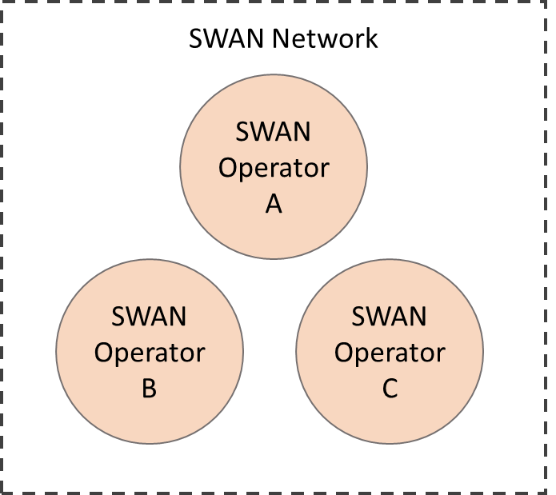
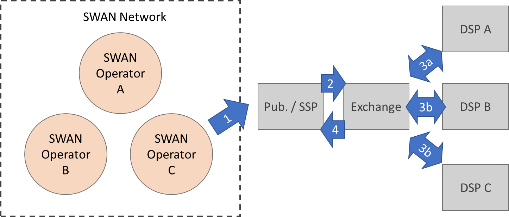
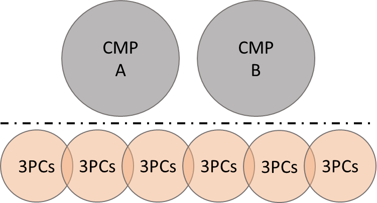
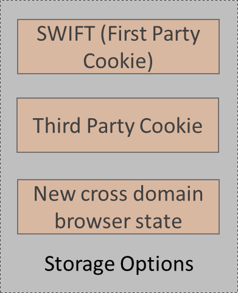
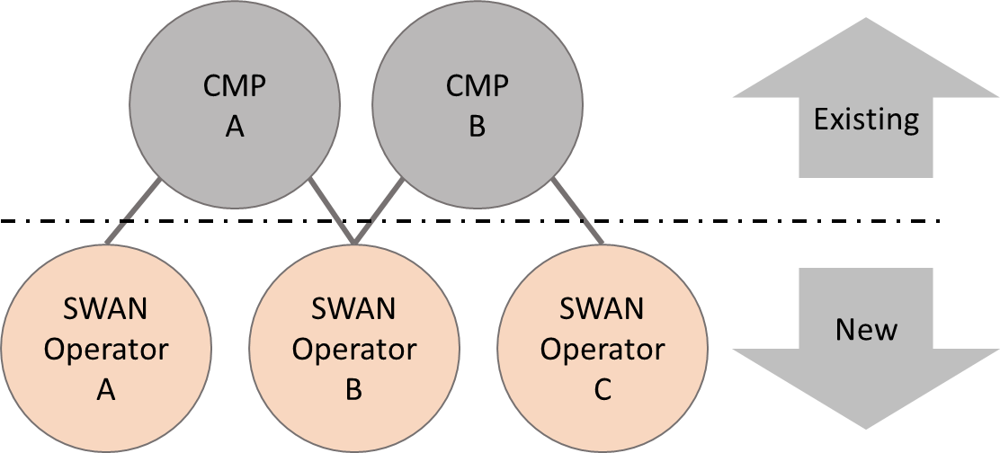
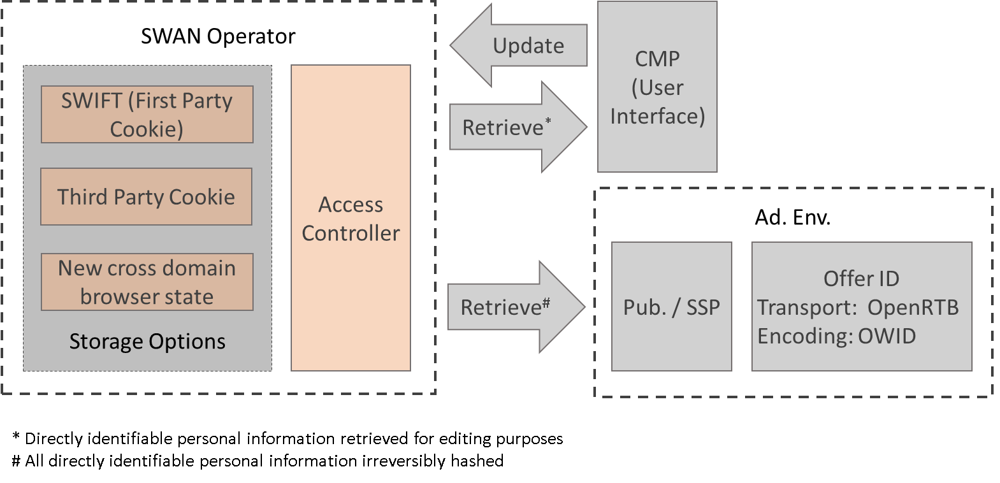
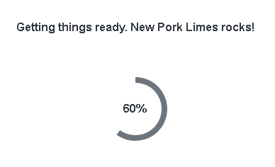

# 

# Secured Web Addressability Network (SWAN) – Principles Explainer

SWAN has been created by considering the various disciplines of law, economics,
government regulation, privacy and engineering. The core principles enable a
competitive, privacy respecting, and decentralized open web.

As such and unlike other open-source projects SWAN is much more than the source
code contained on GitHub. The following principles need to be considered to
appreciate SWAN.

-   Existing privacy laws have resulted in “consent fatigue” for users of web
    services. Implementations place a burden on people to understand the complex
    nature of both privacy and the supply chains involved. SWAN reduces user
    friction whilst improving transparency by requesting consent choices
    infrequently and providing the option for all processors and external
    parties to verify the supply chain at any time.

-   Existing consent dialogues guide the user to accept personalised marketing
    without explaining the value proposition in doing so. Highlighted buttons
    titled “Let me in”, or “Whatever” are now commonly used in Europe to smooth
    people’s access to free content. Those who do not wish to engage in
    personalised marketing are often left confused and untrusting of all
    publishers without good reason. SWAN enables those who do not wish to
    receive personalised marketing to express this preference once rather than
    across every web site they visit. This principle is common with the [Global
    Privacy Control](https://globalprivacycontrol.org/) approach already being
    experiment with by many publishers and privacy advocates.

-   The internet does not have a suitable method of relating data processors and
    controllers to internet domains. For example, the internet domain
    [etsy.com](https://www.etsy.com/) supports many different organisations that
    are unrelated to one another. Publishers such as [News
    Corporation](https://newscorp.com/) or [Cafe Media](https://cafemedia.com/)
    operate many brands with separate domains but operated by the same data
    controller. Attempts to restrict web features to internet domains by
    assuming they are a proxy for data controllers and processors have proved
    problematic. Whilst SWAN utilises internet domains it does not assign access
    rights based on internet domains. It is hoped that the internet and web
    community will reach a similar conclusion in time and amend practices to
    reflect the realities of data controllers and processing in the context of
    the Open Web.

-   Competition in digital markets requires smaller players to join together to
    share data to achieve the scale of dominant highly integrated competitors.
    Regulators recognise the need for a solution that will achieve this goal and
    the urgency involved. SWAN enables multiple processors to both share
    pseudonymous identifiers, personal identifiers, identity and consent choices
    whilst at the same time verify other processors are respecting people’s
    choices and relevant privacy laws. Common contracts containing model clauses
    form the relationship between data controllers and processors are the method
    used to identify bad actors, sanction them and remove them from the
    industry. For example, if an organization’s reputation or practices are such
    that no other party is prepared to contract with them then they become
    excluded without requiring a governing authority to be involved. If an
    organization breaks the laws of a particular jurisdiction then SWAN will aid
    in identify this without prescribing a specific remedy. Remedies are a
    matter for law makers and their police. Interested parties, with peoples
    consent, will also be able to inspect the data and report on trends
    associated with non-compliance. Auditors will also be able to processors.

-   A decentralized solution must not rely on a single internet domain,
    administrator or operator. SWAN uses multiple domains which are designed to
    be changed frequently so that new operators, or new domains operated by an
    existing operator can be introduced to the network without any disruption.

-   The solution must separate the storage of information from other components
    of the eco-system. In addition to the removal of conflicts of interest among
    different participants this will insulate the wider eco-system from changes
    to data storage mechanisms in the future.

-   SWAN will provide people the information they need to understand which
    processors had access to data. Therefore all data processors that receive
    SWAN data must identify themselves in the response in such a way as to
    enable users to be able to inspect these processors when the processing of
    the data is completed. If someone feels they have been harmed as a result of
    the processors’ actions then they will be able to identify the parties
    involved and exercise their rights under the applicable laws.

-   SWAN is governed collectively as a common resource following principles
    outlined by Eleanor Ostrom in her Nobel Prize winning work [Common Pool
    Resource
    principles](https://en.wikipedia.org/wiki/Elinor_Ostrom#Design_principles_for_Common_Pool_Resource_(CPR)_institution).
    These are summarized as follows:

    1.  *Clearly defined (clear definition of the contents of the common pool
        resource and effective exclusion of external un-entitled parties);*

    2.  *The appropriation and provision of common resources that are adapted to
        local conditions;*

    3.  *Collective-choice arrangements that allow most resource appropriators
        to participate in the decision-making process;*

    4.  *Effective monitoring by monitors who are part of or accountable to the
        appropriators;*

    5.  *A scale of graduated sanctions for resource appropriators who violate
        community rules;*

    6.  *Mechanisms of conflict resolution that are cheap and of easy access;*

    7.  *Self-determination of the community recognized by higher-level
        authorities; and*

    8.  *In the case of larger common-pool resources, organization in the form
        of multiple layers of nested enterprises, with small local CPRs at the
        base level.*

Whilst it is not known to the authors of SWAN if the [Wikipedia
Foundation](https://wikimediafoundation.org/about/) was inspired by Eleanor
Ostrom’s work it does appear as if Wikipedia is governed along similar
principles which will already be familiar to those engaged in digital markets.

# Common Questions

## How many SWANs?

SWAN is as technical standard and open-source implementation. Multiple operators
are needed to form a network and define rules that they will all follow. There
could be multiple SWAN networks for different regional laws or data models. The
number of SWANs will therefore be dependent on the number of “commons” for data
that are required.

There are operational limits to the number of SWAN Operators and the percentage
of the overall network that can be controlled by a single Operator. This same
limit is found today at airports where there are limited landing and take off
slots. SWAN’s legal entity model explains how these limits are set and applied
in practice.

## Data model

The SWAN data model will be defined by the SWAN Network. All SWAN Operators and
users will conform to the same data model. At the time of writing the current
fields are.

| **Field**             | **Data Type**         | **Description**                                                      |
|-----------------------|-----------------------|----------------------------------------------------------------------|
| Common Browser ID     | Byte Array (16 bytes) | A random restable identifier for the web browser                     |
| Personalize Marketing | Boolean               | A flag to indicate if personalized marketing is acceptable           |
| Email Address         | String                | An email address provided by the user                                |
| Blocked Adverts       | String Array          | A list of advert IDs that should not be displayed on the web browser |

The current data model is shown in [INSERT DOCUMENT REFERENCE].

Changes to the data model will need to be agreed by the SWAN governance process.
The data model is not expected to change frequently.

## Data ownership

People own their data. Some publishers will need to think differently about the
data that forms SWAN if they are to successfully participate in SWAN.

SWAN stewards people’s data ensuring people are in control at all times.
Identifiers can be reset and processors that received or might have received the
data can be identified. Data within the SWAN Network is only ever persisted in
the web browser, no central persistent storage is involved in the SWAN
components. This also helps keep the operational costs low and the solution
provided as a commodity.

## Data audit

When the data leaves the SWAN network all entities that receive the data are
subject to strict contractual rules that require them to meet clearly defined
requirements and transparency in data processing. This includes signing an audit
trail to indicate receipt of the data, or if no receipt was provided the audit
trail is added to by the sender signing to indicate no response was received.

The following diagram should how data would flow via a simplified OpenRTB
transaction.

All the parties to the transaction, SWAN Operators, Publishers, SSPs, Exchanges
and DSPs will have the same contractual clauses mandated by the SWAN Network.
The following steps are shown.

1.  The Publisher or SSP has a direct relationship with the SWAN Operator to
    read (not write or update) data from the SWAN Operator. They retrieve the
    SWAN information and sign the data to indicate they have received it.

2.  The Publisher or SSP passes the data to the Exchange, who also signs it to
    show they received it.

3.  The Exchange passes the data to multiple DSPs, who also sign to say they
    received it.

4.  The Exchange then passes the data back to the Publisher or SSP. The
    Publisher or SSP must then pass the information about the supply chain that
    was used to serve the advert back to the web browser so that the web browser
    can provide the option for the user to inspect the supply chain or block the
    advert.

If at any point a processor fails to return a signature that can be included in
the transaction and passed back to the requestor then the party that sent the
data must add an additional signature to indicate that they failed to get a
response.

Data audit is supported via a simple signing standard called Open Web ID (OWID).

## Where does SWAN fit?

SWAN requires three changes to the existing programmatic eco-system.

### Shared information storage

SWAN is primarily responsible for the storage of identifiers and preference
state data in the web browser, enabling access to that data from multiple
authorized entities, and for informing people about the data processors that the
data was provided to.

So called third party cookies (3PC) are currently used to store information that
is accessible from different internet domains.

SWAN’s data sharing component, implemented initially using SWIFT, will replace
third party cookie data storage and support identifiers and other common data
that is part of the SWAN data model.

If users enable 3PC to continue to be used on their web browser then the SWAN
solution will make use of them. When they are not available then SWIFT will be
used. SWIFT relies on first party cookies. If these are not available, then the
user will be prompted with a notice requesting they enable first party cookies
to continue and ideally explaining how to do so in their web browser.

It is also conceivable that web browser vendors will in time recognise that SWAN
can be improved by embedding a new form of data storage within the web browser.
SWAN has been designed with this eventual end state in mind.

The following diagram shows the three posisble storage options SWAN can support.
The SWIFT option will always be used when the others are not supported.

### Data access

CMPs, and other consumers of the SWAN data, will need to have a contractual
relationship with one or more SWAN operators to access this shared information.
The following diagram shows how this will work.

As SWAN incentivises competition among operators there is no single operating
entity that CMPs or other data processors will be compelled to work with or
mandatory participation fees. Indeed, there is no requirement for a CMP to use a
particular SWAN Network or use SWAN exclusively.

The following diagram shows the components of a SWAN Operator and a CMP and
Publisher or SSP.

In addition to the data storage options the SWAN Operator will also provide
access control. The SWAN Operator will be free to choose the access control
technology so long as it adheres to a common standard and can be implemented in
the SWAN open source code for audit purposes. For example; one SWAN Operator may
use an access control method based on Azure, and another an open source
solution. They must both meet the same common criteria.

Two types of access will be allowed to the SWAN Network via the SWAN Operator.

#### Read Write

>   SWAN does not provide a user interface for add, update and delete
>   operations. These are expected to be provided by a small number of users
>   that will have read and write access to the data. In the advertising
>   eco-system these are termed Consent Management Platforms (CMPs).

>   CMPs already perform this function today and provide different offerings and
>   services. For example; additional data may be captured and managed in the
>   same user interface.

#### Read Only 

>   The majority of access types will be read only. Publishers and SSPs will
>   fetch the SWAN data at the start of a web session and persist the data for
>   the entirety of the session. They will not be allowed to persist the data
>   beyond the session.

It is expected that a publisher will have a contractual relationship with a CMP
for the purposes of enabling users to administer their SWAN data from the
publishers web site. The publisher will also have a contractual relationship
with the SWAN Operator to read the information.

It is important to remember that the data returned from the SWAN to the
publisher is most likely to have been already added by another CMP, and not the
one that is used by the publisher.

## Requirements of SWAN operators

SWAN Operators must operate an agreed open source solution to strictly defined
parameters. SWAN Operators will be very limited in the features they are able to
provide.

## User Interface

SWAN contains two types of user interface that must be implemented identically
by each operator.

### Progress indicator

The following screen shows the progress of the SWAN storage transaction.

>   

### Message to users

The following is a simple example of a message that will encourage people to
amend their web browser settings if a transaction fails.

>   

## Conclusion

We use common resources all the time without realising it. Next time you book a
flight you are entering into a literally life-threatening transaction with an
airline brand without being required to know who the multiple air traffic
controllers or other suppliers to the airline are. Airline passengers trust the
airline to use the common resource of airspace (the sky) adhering to defined
rules and using appropriate controllers.

The web is no different. SWAN demonstrates identifiers other preference data can
be administered as a common for the benefit of everyone today.
