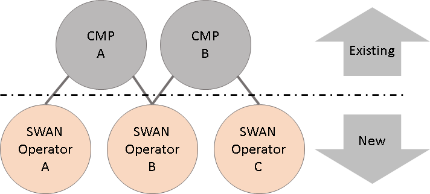

# 

# Secured Web Addressability Network (SWAN) – Principles Explainer

SWAN has been created by considering the various disciplines of law, economics,
government regulation, privacy and engineering. The core principles enable a
competitive, privacy respecting, and decentralized open web.

As such and unlike other open-source projects SWAN is much more than the source
code contained on GitHub. The following principles need to be considered to
appreciate SWAN.

-   Existing privacy laws have resulted in “consent fatigue” for users of web
    services. Implementations place a burden on people to understand the complex
    nature of both privacy and the supply chains involved. SWAN reduces user
    friction whilst improving transparency by requesting consent choices
    infrequently and providing the option for all processors and external
    parties to verify the supply chain at any time.

-   Existing consent dialogues guide the user to accept personalised marketing
    without explaining the value proposition in doing so. Highlighted buttons
    titled “Let me in”, or “Whatever” are now commonly used in Europe to smooth
    people’s access to free content. Those who do not wish to engage in
    personalised marketing are often left confused and untrusting of all
    publishers without good reason. SWAN enables those who do not wish to
    receive personalised marketing to express this preference once rather than
    across every web site they visit. This principle is common with the [Global
    Privacy Control](https://globalprivacycontrol.org/) approach already being
    experiment with by many publishers and privacy advocates.

-   The internet does not have a suitable method of relating data processors and
    controllers to internet domains. For example, the internet domain
    [etsy.com](https://www.etsy.com/) supports many different organisations that
    are unrelated to one another. Publishers such as [News
    Corporation](https://newscorp.com/) or [Cafe Media](https://cafemedia.com/)
    operate many brands with separate domains but operated by the same data
    controller. Attempts to restrict web features to internet domains by
    assuming they are a proxy for data controllers and processors have proved
    problematic. Whilst SWAN utilises internet domains it does not assign access
    rights based on internet domains. It is hoped that the internet and web
    community will reach a similar conclusion in time and amend practices to
    reflect the reality of data control and processing.

-   Competition in digital markets requires smaller players to join together to
    share data to achieve the scale of dominant highly integrated competitors.
    Regulators recognise the need for a solution that will achieve this goal and
    the urgency involved. SWAN enables multiple processors to both share
    pseudonymous identifiers, personal identifiers, identity and consent choices
    whilst at the same time verify other processors are respecting people’s
    choices and relevant privacy laws. Contracts that form the relationship
    between data controllers and processors are the method used to identify bad
    actors, sanction them and remove them from the industry. For example, if an
    organization’s reputation or practices are such that no other party is
    prepared to contract with them then they become excluded without requiring a
    governing authority to be involved. If an organization breaks the laws of a
    particular jurisdiction then SWAN will identify this without prescribing a
    specific remedy. Remedies are a matter for law makers and their police.

-   A decentralized solution must not rely on a single internet domain,
    administrator or operator. SWAN uses multiple domains which are designed to
    be changed frequently so that new operators, or new domains operated by an
    existing operator can be introduced to the network without any disruption.

-   The solution must separate the storage of information from other components
    of the eco-system. In addition to the removal of conflicts of interest among
    different participants this will insulate the wider eco-system from changes
    to data storage mechanisms in the future.

-   SWAN will provide people the information they need to understand which
    processors had access to data. Therefore all data processors that receive
    SWAN data must identify themselves in the response in such a way as to
    enable users to be able to inspect these processors when the processing of
    the data is completed. If someone feels they have been harmed as a result of
    tis data processing then they will be able to identify the parties involved
    and exercise their rights under the applicable laws.

-   SWAN is governed collectively as a common resource following principles
    outlined by Eleanor Ostrom in her Nobel Prize winning work [Common Pool
    Resource
    principles](https://en.wikipedia.org/wiki/Elinor_Ostrom#Design_principles_for_Common_Pool_Resource_(CPR)_institution).
    These are summarized as follows:

    1.  *Clearly defined (clear definition of the contents of the common pool
        resource and effective exclusion of external un-entitled parties);*

    2.  *The appropriation and provision of common resources that are adapted to
        local conditions;*

    3.  *Collective-choice arrangements that allow most resource appropriators
        to participate in the decision-making process;*

    4.  *Effective monitoring by monitors who are part of or accountable to the
        appropriators;*

    5.  *A scale of graduated sanctions for resource appropriators who violate
        community rules;*

    6.  *Mechanisms of conflict resolution that are cheap and of easy access;*

    7.  *Self-determination of the community recognized by higher-level
        authorities; and*

    8.  *In the case of larger common-pool resources, organization in the form
        of multiple layers of nested enterprises, with small local CPRs at the
        base level.*

Whilst it is not known to the authors of SWAN if the [Wikipedia
Foundation](https://wikimediafoundation.org/about/) was inspired by Eleanor
Ostrom’s work it does appear as if Wikipedia is governed along similar
principles which will already be familiar to those engaged in digital markets.

# Expected Questions

## How many SWANs?

SWAN is as technical standard and open-source implementation. Multiple operators
are needed to form a network and define rules that they will all follow. There
could be multiple SWAN networks for different regional laws or data models. The
number of SWANs will therefore be dependent on the number of “commons” for data
that are required. There could be a single a global SWAN, or one for each major
global region. This will need to be decided in due course.

## Where does SWAN fit?

SWAN requires two changes to the existing programmatic eco-system.

### Shared information storage

SWAN is primarily responsible for the storage of data across multiple domains
within the web browser, and for informing people about the data processors that
the data was provided to.

So called third party cookies are currently used to store information that is
accessible across different internet domains. SWAN’s data sharing component,
implemented initially using SWIFT, will replace third party cookie data storage
and support identifiers and other common data that is part of the SWAN data
model.

It is therefore expected that CMPs will need to have a relationship with one or
more SWAN operators to access this shared information. The following diagram
shows how this will work.

As SWAN incentivises competition among operators there is no single operating
entity that CMPs or other data processors will be compelled to work with or
mandatory participation fees. Indeed, there is no requirement for a CMP to use a
particular SWAN, or use SWAN exclusively.

For the avoidance of doubt parties other than CMPs may also interact with the
SWAN network via SWAN Operators.

### Signing and verification

Every processor that receives information that was stored in a SWAN must
cryptographically sign the transaction in their response to confirm they
received the data. If the processor does not support this ability, then another
processor can not pass the information to them. It is expected this requirement
will be achieved by amendments to the commercial contracts between data
processors. Any processor that passes SWAN originated data to another entity
that does not support the SWAN signing feature will be in violation of their
agreement with the provider of the SWAN data.

Each processor will need to implement the SWAN solution so that they can sign
the transaction. This will involve deploying the open-source code and adding a
stage to the processing of the data to create and append the signature to the
transaction.

For example, a publisher using an advertising server provided by a software or
service supplier would request that the supplier includes the SWAN signing
feature to their product or service. The publisher would configure the SWAN and
enable the feature. The user of the software or service is therefore the SWAN
processor and not the provider of the software of service.

A publisher that wished to verify the supply chain before displaying the advert
might additionally enable the feature from the software supplier that verifies a
percentage of advertising responses prior to display.

## Requirements of SWAN operators

-   Adherence to agreed rules for the SWAN network. See administration.

-   Secure storage of data to be shared across domains and organizations. In the
    case of SWIFT this would require common user interfaces for the display of
    progress and failure messages. The following two screens are current
    examples of these interfaces.

    

    

-   Operating additional methods used to store and share information. For
    example, initially SWAN is implemented using multiple domains and cookies.
    In the future alternative methods of sharing information across internet
    domains may be supported by the browser. SWAN Operators and the SWAN network
    administrator will be responsible for selecting and adopting these methods.

## Administration

SWAN operators in a network will be free to establish their own administration.
It is expected that the following scope would apply to all SWAN network
administration.

-   Agree current version of the standard, data mode, and open-source
    implementations. This will be needed to ensure interoperability.

-   Where multi domain SWIFT data storage is used limit the total number of
    domains that form the network to ensure usability.

-   Represent the SWAN network and implement to other eco-system stakeholders
    including web browser vendors.

-   Agree quality of service requirements such as average response times and
    uptime requirements for operators.

## Conclusion

We use common resources all the time without realising it. Next time you book a
flight you are entering into a literally life-threatening transaction with an
airline brand without being required to know who the multiple air traffic
controllers or other suppliers to the airline are. Airline passengers trust the
airline to use the common resource of airspace (the sky) adhering to defined
rules and using appropriate controllers.

The web is no different. SWAN demonstrates identifiers, and other data can be
administered as a common for the benefit of everyone today.
